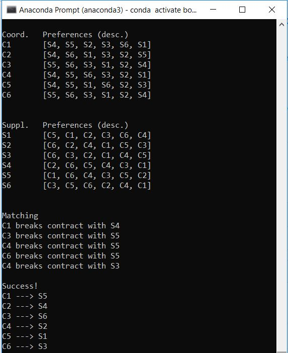

Data

<ul>
  <li>6 Project Coordinators</li>
  <li>6 Suppliers</li>
  <li>Each single coordinator and supplier is called 'party' in the script</li>
  <li>Number of parties can be set in the script</li>
  <li>Constraints: number of coordinators = number of suppliers</li>
  <li>Each party has its own 6 items list of preferences</li>
  <li>Project Coordinators chooses preffered Suppliers in sequence starting from the most preffred one and vice versa</li>
  <li>Script uses random library to shuffle prefrerences for each party</li>
  <li>Script matches coordinator-suppliers pairs according to their preferences list</li>
  <li>
    Script continues matching and breaking matches till we have all the parties matched up and no one from the pairs has better preffered       option - its called stable match.
  </li>
</ul>

Outcome:

